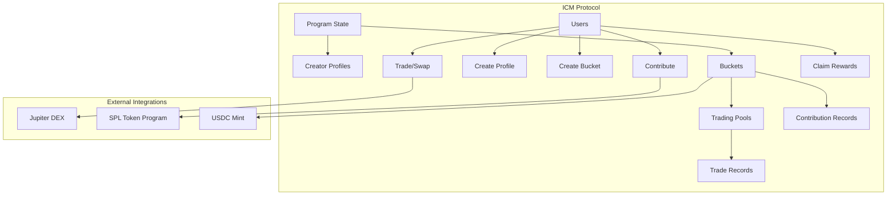

# ICM Program - Technical Documentation

## 📋 Table of Contents

- [Program Overview](#program-overview)
- [Architecture](#architecture)
- [Smart Contract Structure](#smart-contract-structure)
- [State Definitions](#state-definitions)
- [Instruction Flow](#instruction-flow)
- [PDA (Program Derived Address) Structure](#pda-structure)
- [Security Features](#security-features)
- [Integration Guide](#integration-guide)
- [Testing](#testing)

## 🏗️ Program Overview

The ICM (Investment Club Manager) Program is a Solana-based DeFi protocol that enables collaborative investment management through "buckets" - structured investment vehicles where multiple users can pool funds for collective trading and investment strategies.

**Program ID:** `D9FTJfyEDggzkNTGuA73yUHW6we89VowNtfCwmYKV4NU`

### Key Components

- **Bucket Creation & Management**: Users can create investment buckets with configurable parameters
- **Contribution System**: Multi-user fund pooling with time-windowed contributions
- **Trading Engine**: Integrated DEX trading with Jupiter protocol support
- **Reward Distribution**: Proportional profit/loss sharing among contributors
- **Fee Management**: Creator fees, management fees, and protocol fees

## 🏛️ Architecture



## 🔧 Smart Contract Structure

### Core Modules

```rust
// lib.rs - Main program entry point
#[program]
mod icm_program {
    // 9 main instruction handlers
    pub fn create_profile(ctx: Context<CreateProfile>) -> Result<()>
    pub fn create_bucket(...) -> Result<()>
    pub fn contribute_to_bucket(...) -> Result<()>
    pub fn start_trading(...) -> Result<()>
    pub fn close_bucket(...) -> Result<()>
    pub fn claim_rewards(...) -> Result<()>
    pub fn swap_tokens(...) -> Result<()>
    pub fn initialize_program(...) -> Result<()>
    pub fn withdraw_fees(...) -> Result<()>
}
```

### File Structure

```
programs/icm-program/src/
├── lib.rs                 # Main program entry point
├── state.rs              # Account state definitions
├── constants.rs          # Program constants
├── error.rs             # Custom error definitions
├── utils.rs             # Utility functions
└── instructions/        # Instruction handlers
    ├── mod.rs
    ├── create_profile.rs
    ├── create_bucket.rs
    ├── contribute_to_bucket.rs
    ├── start_trading.rs
    ├── close_bucket.rs
    ├── claim_rewards.rs
    ├── swap_tokens.rs
    ├── initialize_program.rs
    └── withdraw_fees.rs
```

## 📊 State Definitions

### Primary Accounts

#### 1. ProgramState

```rust
#[account]
pub struct ProgramState {
    pub owner: Pubkey,                // Protocol owner
    pub fee_rate_bps: u16,           // Protocol fee (basis points)
    pub usdc_mint: Pubkey,           // USDC token mint
    pub total_fees_collected: u64,   // Accumulated protocol fees
    pub initialized: bool,           // Initialization flag
    pub created_at: i64,            // Creation timestamp
    pub bump: u8,                   // PDA bump seed
}
```

#### 2. Bucket

```rust
#[account]
pub struct Bucket {
    pub creator: Pubkey,             // Bucket creator
    pub name: String,               // Bucket identifier
    pub token_mints: Vec<Pubkey>,   // Supported tokens (max 3)
    pub contribution_deadline: i64,  // Contribution phase end
    pub trading_deadline: i64,      // Trading phase end
    pub creator_fee_percent: u16,   // Creator fee (basis points)
    pub status: BucketStatus,       // Current bucket state
    pub trading_started_at: i64,    // Trading start timestamp
    pub closed_at: i64,            // Bucket closure timestamp
    pub bump: u8,                  // PDA bump seed
    pub creator_profile: Pubkey,    // Creator's profile
    pub performance_fee: u64,       // Performance-based fee
    pub raised_amount: u64,         // Total contributions
    pub contributor_count: u32,     // Number of contributors
}
```

#### 3. TradingPool

```rust
#[account]
pub struct TradingPool {
    pub pool_id: Pubkey,            // Associated bucket
    pub pool_bump: u8,              // PDA bump seed
    pub creator: Pubkey,            // Pool creator
    pub token_bucket: Vec<Pubkey>,  // Token whitelist
    pub target_amount: u64,         // Fundraising target
    pub min_contribution: u64,      // Minimum contribution
    pub max_contribution: u64,      // Maximum contribution
    pub trading_duration: u64,      // Trading window duration
    pub created_at: i64,           // Creation timestamp
    pub fundraising_deadline: i64,  // Contribution deadline
    pub trading_start_time: Option<i64>, // Trading start
    pub trading_end_time: Option<i64>,   // Trading end
    pub phase: PoolPhase,          // Current phase
    pub management_fee: u64,       // Management fee
}
```

#### 4. ContributionRecord

```rust
#[account]
pub struct ContributionRecord {
    pub contributor: Pubkey,        // Contributor wallet
    pub bucket: Pubkey,            // Target bucket
    pub token_mint: Pubkey,        // Contributed token
    pub amount: u64,               // Contribution amount
    pub timestamp: i64,            // Contribution time
}
```

#### 5. CreatorProfile

```rust
#[account]
pub struct CreatorProfile {
    pub creator: Pubkey,            // Creator wallet
    pub pools_created: u32,         // Total pools created
    pub successful_pools: u32,      // Successful pools
    pub total_volume_managed: u64,  // Total managed volume
    pub reputation_score: u32,      // Reputation metric
    pub created_at: i64,           // Profile creation
}
```

### Enums

```rust
#[derive(AnchorSerialize, AnchorDeserialize, Clone, PartialEq, Eq)]
pub enum BucketStatus {
    Raising,    // Accepting contributions
    Trading,    // Active trading phase
    Closed,     // Completed/closed
}

#[derive(AnchorSerialize, AnchorDeserialize, Clone, PartialEq, Eq)]
pub enum PoolPhase {
    Raising,    // Fundraising phase
    Trading,    // Trading phase
    Closed,     // Completed phase
}

#[derive(AnchorSerialize, AnchorDeserialize, Clone, PartialEq, Eq)]
pub enum TradeType {
    BuyToken,   // Token purchase
    SellToken,  // Token sale
    Rebalance,  // Portfolio rebalancing
}
```

## 🔄 Instruction Flow

### 1. Program Initialization

```
initialize_program(fee_rate_bps) → ProgramState
```

### 2. Creator Onboarding

```
create_profile() → CreatorProfile
```

### 3. Bucket Lifecycle

```
create_bucket(...) → Bucket + TradingPool + VaultTokenAccount
    ↓
contribute_to_bucket(...) → ContributionRecord (multiple users)
    ↓
start_trading(...) → Status: Trading
    ↓
swap_tokens(...) → TradeRecord (multiple trades)
    ↓
close_bucket() → Status: Closed
    ↓
claim_rewards() → Distribute profits/losses
```

### 4. Fee Collection

```
withdraw_fees() → Transfer protocol fees to owner
```

## 🔑 PDA (Program Derived Address) Structure

### Account Seeds

| Account Type       | Seeds                                                | Example                                                   |
| ------------------ | ---------------------------------------------------- | --------------------------------------------------------- |
| ProgramState       | `[b"program_state"]`                                 | `["program_state"]`                                       |
| CreatorProfile     | `[b"creator_profile", creator.key()]`                | `["creator_profile", <creator_pubkey>]`                   |
| Bucket             | `[b"bucket", name.bytes(), creator.key()]`           | `["bucket", "my-bucket", <creator_pubkey>]`               |
| TradingPool        | `[b"trading_pool", name.bytes(), creator.key()]`     | `["trading_pool", "my-bucket", <creator_pubkey>]`         |
| ContributionRecord | `[b"contribution", bucket.key(), contributor.key()]` | `["contribution", <bucket_pubkey>, <contributor_pubkey>]` |

### Vault Token Accounts

- **Bucket Vault**: Associated Token Account owned by Bucket PDA
- **Fee Vault**: Associated Token Account owned by ProgramState PDA

## 🛡️ Security Features

### Access Controls

- **Creator-only operations**: `start_trading()`, `swap_tokens()`, `close_bucket()`
- **Owner-only operations**: `initialize_program()`, `withdraw_fees()`
- **Time-based restrictions**: Contribution windows, trading windows

### Validation Checks

- **Input validation**: String lengths, numeric ranges, token mint verification
- **State validation**: Phase transitions, deadline enforcement
- **Balance verification**: Sufficient funds, overflow protection

### Fee Structure

- **Bucket creation fee**: 0.7 USDC (prevents spam)
- **Creator fees**: Configurable per bucket (up to maximum)
- **Protocol fees**: System-wide fee rate in basis points

## 🔌 Integration Guide

### Client SDK Usage

```typescript
import { Program, AnchorProvider } from "@coral-xyz/anchor";
import { ICMProgram } from "./types/icm_program";

// Initialize program
const program = new Program<ICMProgram>(IDL, programId, provider);

// Create bucket
await program.methods
  .createBucket(
    "my-bucket", // name
    [tokenMintA, tokenMintB], // token_mints
    1440, // contribution_window_minutes (24h)
    10080, // trading_window_minutes (7 days)
    500, // creator_fee_percent (5%)
    1000000, // target_amount
    10000, // min_contribution
    100000, // max_contribution
    250 // management_fee
  )
  .accounts({
    bucket,
    tradingPool,
    vaultTokenAccount,
    creatorProfile,
    programState,
    feeVault,
    creatorTokenAccount,
    usdcMint,
    creator,
    tokenProgram,
    associatedTokenProgram,
    systemProgram,
  })
  .rpc();
```

### Frontend Integration

```typescript
// Contribution example
const contributeTransaction = await program.methods
  .contributeToBucket("my-bucket", new anchor.BN(50000))
  .accounts({
    bucket,
    contributionRecord,
    contributor,
    contributorTokenAccount,
    vaultTokenAccount,
    usdcMint,
    tokenProgram,
    systemProgram,
  })
  .transaction();
```

## 🧪 Testing

### Test Environment Setup

```bash
# Install dependencies
npm install

# Build program
anchor build

# Deploy to localnet
anchor deploy

# Run tests
anchor test
```

### Test Structure

```
tests/
├── icm-program.ts        # Main test suite
└── test-users/
    └── users.ts          # Test user utilities
```

### Key Test Scenarios

- ✅ Program initialization
- ✅ Creator profile creation
- ✅ Bucket creation with various parameters
- ✅ Multi-user contributions
- ✅ Trading phase transitions
- ✅ Token swapping via Jupiter
- ✅ Reward claiming and distribution
- ✅ Fee collection and withdrawal
- ✅ Error handling and edge cases

### Performance Metrics

- **Transaction size**: Optimized for Solana's 1232-byte limit
- **Compute units**: Efficient instruction design
- **Account rent**: Rent-exempt account sizing
- **Concurrent users**: Multi-user contribution support

## 📈 Gas Optimization

### Account Size Optimization

- Use of `InitSpace` derive macro for precise space calculation
- Efficient data structure packing
- Minimal account dependencies

### Instruction Efficiency

- Batch operations where possible
- Minimal cross-program invocations
- Optimized PDA derivations

## 🔧 Configuration

### Constants (constants.rs)

```rust
pub const BUCKET_CREATION_FEE: u64 = 700_000; // 0.7 USDC
pub const MAX_CREATOR_FEE_BPS: u16 = 2000;    // 20%
pub const MAX_TOKEN_MINTS: usize = 3;
```

### Environment Variables

- `USDC_MINT`: USDC token mint address
- `JUPITER_PROGRAM_ID`: Jupiter aggregator program ID
- `RPC_URL`: Solana cluster RPC endpoint

---

**Last Updated**: October 2025  
**Program Version**: 0.1.0  
**Anchor Version**: 0.30.1  
**Solana Version**: 1.16.0
